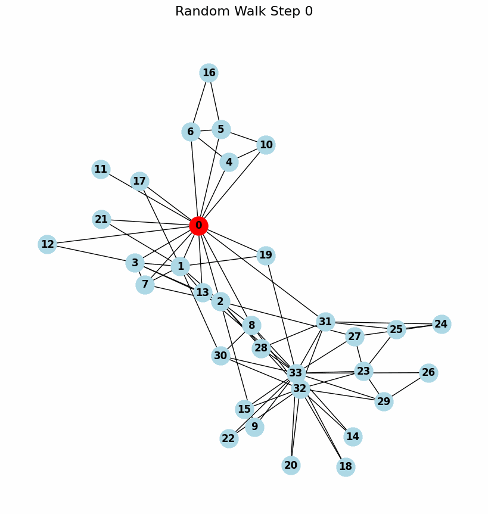
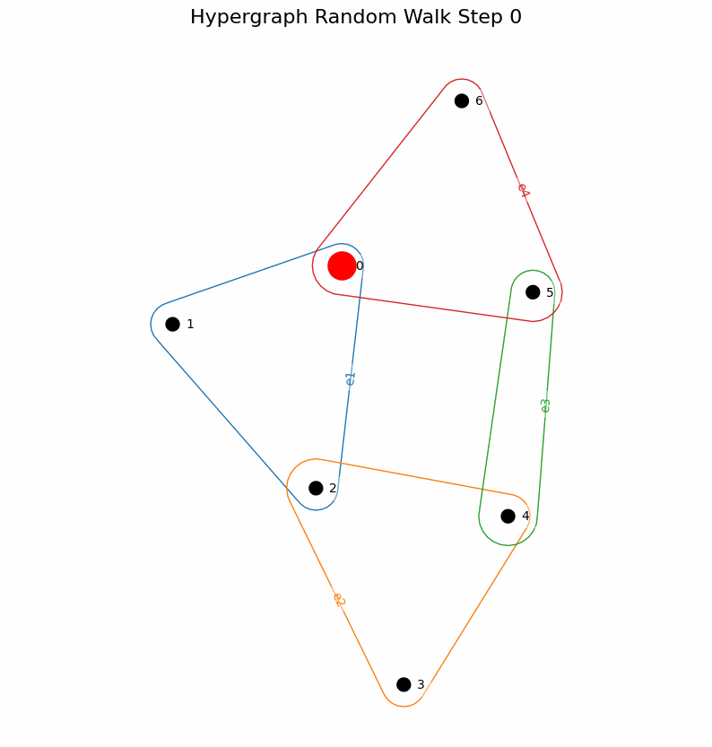

<div align="center">
  <a href="https://github.com/Weber-GeoML/Hypergraph_Encodings/actions/workflows/pylint.yml">
    
  </a>
  <a href="https://github.com/Weber-GeoML/Hypergraph_Encodings/actions/workflows/pytest.yml">
    
  </a>
  <a href="https://github.com/Weber-GeoML/Hypergraph_Encodings/actions/workflows/python-package.yml">
    
  </a>
  <a href="https://github.com/Weber-GeoML/Hypergraph_Encodings/actions/workflows/ruff.yml">
    
  </a>
  <a href="https://github.com/Weber-GeoML/Hypergraph_Encodings/actions/workflows/mypy.yml">
    
  </a>
  <a href="https://www.python.org/downloads/release/python-3110/">
    
  </a>
</div>


<p align="center">
  
  
</p>


# Hypergraph_Encodings

## Organisation of repo

```data/``` 

contains the coauthorship and cocitation data.

```src/```

contains backend functions for the package.

```scripts/``` 

contains the interface. You can also run the bash scripts.

```tests/```

contains the test files - we use pytest.

```computed_encodings/```

contains the precomputed encodings saved as pickle files.

```gifs/```

contains the gifs of the random walks.

```.github/workflows/```

contains the github actions workflows.


We follow the interface from UniGCN:

```
python scripts/train_val.py --data=coauthorship --dataset=dblp --model-name=UniSAGE 
```

will run the node level classification on the dblp dataset with the UniSAGE model.

We have the following optional arguments that are in the script/config.py file:

```
optional arguments:
  -h, --help                          show this help message and exit
  --add-encodings BOOL                whether to add encodings (default: True)
  --encodings ENCODING                which encoding to add (default: LDP)
  --random-walk-type RANDOMWALKTYPE   which random walk (WE, EN, EE)
  --curvature-type CURVATURETYPE      which curvature (ORC or FRC)
  --laplacia-type  LAPLACIANTYPE      whcih Laplacian type (Normalized, Hodge, more to come)
  --k-rw k                            number of hops for RW encodings
  --data DATA                         data name (coauthorship/cocitation) (default: coauthorship)
  --dataset DATASET                   dataset name (e.g.: cora/dblp for coauthorship, cora/citeseer/pubmed for cocitation) (default: cora)
  --model-name MODEL_NAME             UniGNN Model(UniGCN, UniGAT, UniGIN, UniSAGE...)(default: UniSAGE)
  --first-aggregate FIRST_AGGREGATE   aggregation for hyperedge h_e: max, sum, mean (default: mean)
  --second-aggregate SECOND_AGGREGATE aggregation for node x_i: max, sum, mean (default: sum)
  --add-self-loop                     add-self-loop to hypergraph (default: False)
  --use-norm                          use norm in the final layer (default: False)
  --activation ACTIVATION             activation layer between UniConvs (default: relu)
  --nlayer NLAYER                     number of hidden layers (default: 2)
  --nhid NHID                         number of hidden features, note that actually it's #nhid x #nhead (default: 8)
  --nhead NHEAD                       number of conv heads (default: 8)
  --dropout DROPOUT                   dropout probability after UniConv layer (default: 0.6)
  --input-drop INPUT_DROP             dropout probability for input layer (default: 0.6)
  --attn-drop ATTN_DROP               dropout probability for attentions in UniGATConv (default: 0.6)
  --lr LR                             learning rate (default: 0.01)
  --wd WD                             weight decay (default: 0.0005)
  --epochs EPOCHS                     number of epochs to train (default: 200)
  --n-runs N_RUNS                     number of runs for repeated experiments (default: 10)
  --gpu GPU                           gpu id to use (default: 0)
  --seed SEED                         seed for randomness (default: 1)
  --patience PATIENCE                 early stop after specific epochs (default: 200)
  --nostdout                          do not output logging to terminal (default: False)
  --split SPLIT                       choose which train/test split to use (default: 1)
  --out-dir OUT_DIR                   output dir (default: runs/test)
```

## Adding encodings

This is done in the src/encodings_hnns/save_lukas_encodings.py file. (to be moved to scripts)


## Data

### Graph


<div align="justify"> Collab, Imdb and Reddit are proposed in (Yanardag & Vishwanathan, 2015). Collab is a collection of ego-networks where nodes are researchers. The labels correspond to the fields of research of the authors. Imdb is also a collection of ego-networks. Nodes are actors and an edge between two nodes is present if the actors played together. The labels correspond to the genre of movies used to construct the networks. Reddit is a collection of graphs corresponding to online discussion threads on reddit. Nodes correspond to users, who are connected if they replied to each other comments. The task consists in determining if the community is a discussion- community or a question answering community. Mutag is a collection of graphs corresponding to nitroaromatic compounds (Debnath et al., 1991). The goal is to predict their mutagenicity in the Ames test (Ames et al., 1973) using S. typhimurium TA98. Proteins and Enzymes are introduced in (Borgwardt et al., 2005). These datasets use the 3D structure of the folded proteins to build a graph of amino acids (Borgwardt et al., 2005). Peptides is a chemical data set introduced in (Dwivedi et al., 2022). The graphs are derived from peptides, short chains of amino acid, such that the nodes correspond to the heavy (non-hydrogen) while the edges represent the bonds between them. Peptides-func is a graph classification task, with a total of 10 classes based on the peptide function (Antibacterial, Antiviral, etc). peptides-struct is a graph regression task. </div>

### Hypergraph


<div align="justify"> We use five datasets that are naturally parametrized as hypergraphs: pubmed, Cora co-authorship (Cora-CA), cora co-citation (Cora-CC), Citeseer (Sen et al., 2008) and DBLP (Rossi & Ahmed, 2015). We use the same pre-processed hypergraphs as in Yadati et al. (2019), which are taken from Huang & Yang (2021). The hypergraphs are created with each vertex representing a document. The Cora data set, for example, contains machine learning papers divided into one of seven classes. In a given graph of the co-authorship datasets Cora-CA and DBLP, all documents co-authored by one author form one hyperedge. In pubmed, citeseer and Cora-CC, all documents cited by an author from one hyperedge. </div>

### BREC


<div align="justify"> The BREC dataset is an expressiveness dataset containing 1-WL-indistinguishable graphs in 4 categories: Basic, Regular, Extension, and CFI graphs (Wang & Zhang, 2024). The 140 pairs of regular graphs are further sub-categorized into simple regular graphs (50 pairs), strongly regular graphs (50 pairs), 4-vertex condition graphs (20 pairs) and distance regular graphs (20 pairs). Note that we remove pairs that include non-connected graphs from the original 400 pairs to arrive at a total of 390 pairs. Graphs in the Basic category (60 pairs, of which we remove 4) are non-regular. Some of the CFI graphs are 4-WL-indistinguishable. </div>


IMPORTANT NOTE: We are working on making the code as general, but for now, assume that the hyperedges (lists) contains vertices in sorted order.

## How to run

Create a virtual env, activate it and install the required packages.

```
conda create -n encodings_venv python=3.11
conda activate encodings_venv
pip install -e .
```
You might need to install julia separately as well as the ORC routine calls julia code.

You might also need to installl PyTorch, torch-geometric and torch-scatter:

```
conda install pytorch -c pytorch
conda install pyg -c pyg
conda install pytorch-scatter -c pyg
```

## Debugging

Using Visual Studio, navigate to the file 

```
scripts/train_val.py
``` 

and use the build in debugger. You can add breakpoints etc.

To run the script with multiple parameters, there is the bash script:

```
run_all_general.sh
```

We can aggregate the results using the script:

```
python scripts/create_results_table.py
```

## Tests

We have a test suite that runs using pytest.

Simply run:

```
pytest
``` 
from root. That sould look for all tests and run them. You can run

```
pytest --verbose
```
for more prints.

For a file in particular, run:

```
pytest tests/test_curvature.py
``` 


## Julia

You might need to give permission to the file. Eg

```
chmod +x /Users/pellegrinraphael/Desktop/Repos_GNN/Hypergraph_Encodings/src/orchid/orchid_interface.jl
```

